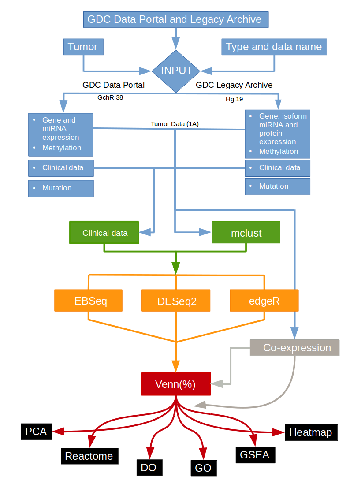
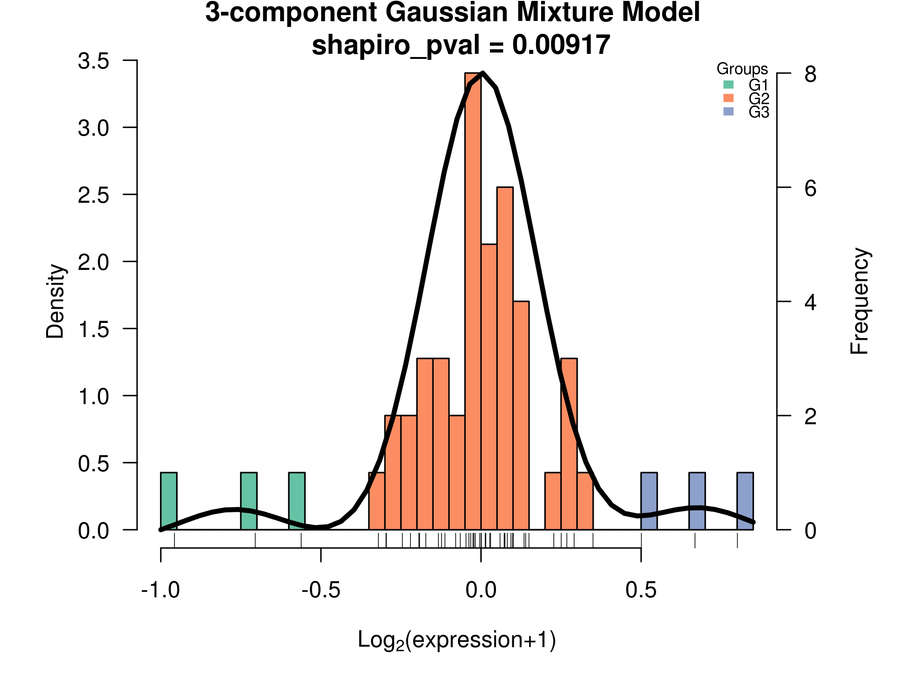

============================================

<!-- [](https://travis-ci.org/tidyverse/ggplot2) [](https://codecov.io/github/tidyverse/ggplot2?branch=master) [](https://cran.r-project.org/package=ggplot2) -->


<!-- README.md is generated from README.Rmd. Please edit that file -->

```{r, echo = FALSE}
knitr::opts_chunk$set(
  collapse = TRUE,
  comment = "#>",
  fig.path = "man/figures/README-"
)
```

# GDCRtools

The GDCRtools package was made to download, organize and analyze Genomic Data Commons (GDC) data. It implements and uses many well-known R packages, as DESeq2, edgeR, mclust, and WGCNA. This is a free open-source software that implements academic research by the authors and co-workers. If you use it, please support the project by citing the appropriate journal article listed running the following command `citation("GDCRtools")`.

## Installation

``` r
# Get GDCRtools from GitHub:
# install.packages("devtools")
devtools::install_github("Facottons/GDCRtools")
```

## Usage

There are many possible paths to be taken in GDCRtools analysis workflow:

<!--  -->


The start point for all possible analyses is the `download_gdc()` function. As its name suggests, this function automatically download all selected data, and store it inside the appropriate folders. After this step the download data can be concatenate into a single table using the `concatenate_files()` function. You then choose which functions to be used in the next steps:

1.  groups identification (like `groups_identification_coxHR()`, `groups_identification_mclust()`, or `check_clinical_terms()`). 
2.  differential expression analysis (dea) (like `dea_DESeq2()`, `dea_EBSeq()`, and/or `dea_edgeR()`). 
3.  visualization (like `draw_heatmap()`, or `PCA_Analysis()`).
4.  Pathway enrichment analysis (like `groups_identification_coxHR()`, `groups_identification_mclust()`, or `check_clinical_terms()`).

## Example

This is a entire example which shows how to run a dea analysis, with groups generated by 'Caspase-8-M-E' expression:

``` r
library(GDCRtools)

# set the work dir path
DIR <- "/any/full/path/name"

# set the data type to use in groups identification step.
Data <- "protein"

# set the desired data base to use ("gdc" or "legacy") 
## for using GDC Legacy Archive
DB <- "legacy" 

# set the tumor type
## for using 'Uterine Carcinosarcoma'
Tumor <- "UCS"


# step 1: Download
download_gdc(dataType = Data, tumor = Tumor, dataBase = DB,
  workDir = DIR)


# step 2: concatenate into a single table
## first normalized data to groups identification 
concatenate_files(dataType = Data,
  Name = "Caspase-8-M-E",
  normalization = TRUE,
  tumorData = TRUE,
  dataBase = DB,
  workDir = DIR, 
  tumor = Tumor)
  
```
It was created an object called `UCS_LEGACY_protein_tumor_data`, its name is based on your initial setups (i.e. <b>tumor</b> _ <b>data-base</b> _ <b>data-type</b> _tumor_data). This object avoid data being messed up, keeping tumors, data bases, and data types in the correct environment. All downstream objects are going to be store inside this environment. From now on, you must use the name of this recent created object as value to the `env` function arguments.

``` r
## now not normalized data as required by the dea packages
### remember to use the object mentionate later 
concatenate_files(dataType = "gene",
  normalization = FALSE,
  tumorData = TRUE,
  dataBase = "legacy",
  workDir = DIR,
  tumor = Tumor,
  env = UCS_LEGACY_protein_tumor_data)

# step 3: groups identification
## forcing three groups here ("G1", "G2", "G3")
groups_identification_mclust(dataType = Data,
  Name = "Caspase-8-M-E",
  tumor = Tumor, 
  group.number = 3,
  dataBase = DB,
  workDir = DIR,
  env = UCS_LEGACY_protein_tumor_data)

``` 


``` r
# step 4: dea
## using edgeR 'exactTest' method 
dea_edgeR(dataType = Data,
  Name = "Caspase-8-M-E",
  Method = "exactTest",
  workDir = DIR,
  env = UCS_LEGACY_protein_tumor_data)
  
``` 


``` r  
# step 5: visualization 
## PCA of 'G2_over_G1'
PCA_Analysis(Tool = "edgeR", 
  dataType = Data,
  Name = "Caspase-8-M-E",
  pairName = "G2_over_G1",
  env = UCS_LEGACY_protein_tumor_data)
  
``` 


``` r
## Heat Map of 'G2_over_G1'  
draw_heatmap(Tool = "edgeR",
  dataType = Data,
  Name = "Caspase-8-M-E",
  Method = "euclidean",
  pairName = "G2_over_G1",
  env = UCS_LEGACY_protein_tumor_data)
  
``` 


``` r
# step 6: Pathway enrichment analysis
## using only the 'Upregulated' genes
### powered by goseq and enrichGO 
GOnto(condition = "Upregulated",
  Tool = "edgeR",
  env = UCS_LEGACY_protein_tumor_data)
}

```


## More information

If you would like more information, please check the GDCRtools <a href="https://github.com/Facottons/GDCRtools/tree/master/vignettes/GDCRtools-vignette" target="_blank">vignette</a> or the GDCRtools <a href="https://github.com/Facottons/GDCRtools/tree/master/" target="_blank">Manual</a> to learn even more. 

## Getting help

There are three main places to get help with GDCRtools:

1.  <a href="https://stackoverflow.com/" target="_blank">stackoverflow</a> is a great source of programming questions and their answers. It is also a amazing place to get help with a helpful community. Before ask any questions please read the <a href="https://stackoverflow.com/help/how-to-ask" target="_blank">how to ask</a> guide.

2.  The <a href="https://groups.google.com/forum/?fromgroups#!forum/ggplot2" target="_blank">GDCRtools mailing list</a> is another great alternative to ask any questions about GDCRtools. Although anybody can read the archived discussions, to post messages you must be a member. 

3.  The <a href="https://community.rstudio.com/" target="_blank">RStudio community</a> is another good place to ask any questions about GDCRtools.
