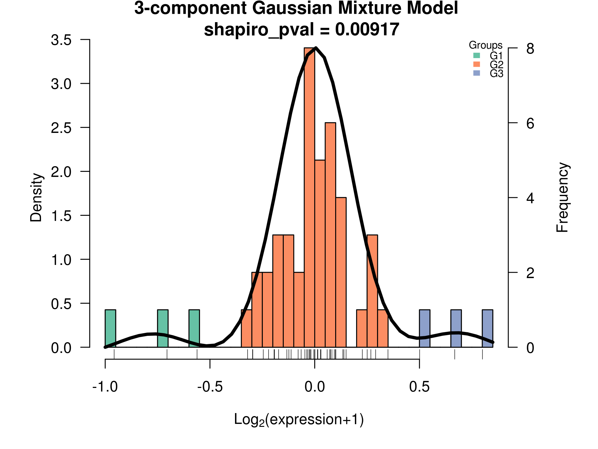

# 

<!-- [](https://travis-ci.org/tidyverse/ggplot2) [](https://codecov.io/github/tidyverse/ggplot2?branch=master) [](https://cran.r-project.org/package=ggplot2) -->

<!-- README.md is generated from README.Rmd. Please edit that file -->

The DOAGDC package was developed to download, organize and analyze
Genomic Data Commons (GDC) data. It uses several well-known R packages,
as DESeq2, edgeR, mclust, and WGCNA. This is a free open-source software
that implements academic research by the authors and co-workers. If you
use it, please support the project by citing the appropriate journal
article listed running the following command `citation("DOAGDC")`.

## Installation

``` r
# Get DOAGDC from GitHub:
install.packages("devtools") # if not already done 
devtools::install_github("Facottons/DOAGDC")
```

## Usage

There are some possible paths in DOAGDC analysis
workflow:

<!--  -->


The start point for all possible analyses is the `download_gdc()`
function. As the name suggests, this function automatically download all
selected data, and store it inside the appropriate folders. After this
step, the download data can be concatenated into a single table using
the `concatenate_files()` function. Then, choose which functions should
be used in the next steps:

1.  Groups Identification (like `groups_identification_coxHR()`,
    `groups_identification_mclust()`, or `check_clinical_terms()`).
2.  Differential Expression Analysis (dea) (like `dea_DESeq2()`,
    `dea_EBSeq()`, and/or `dea_edgeR()`).
3.  Visualization (like `draw_heatmap()`, or `PCA_Analysis()`).
4.  Pathway enrichment analysis (like `GOnto()`, `GSEA()`,
    `DO.REAC.ENRICH()`, or `KEEG_ENRICH()`).

## Example

This is a entire example that shows how to run a dea analysis, with
groups generated by ‘Caspase-8-M-E’ expression:

``` r
library(DOAGDC)

# set the work dir path
DIR <- "/any/full/path/name"

# set the data type to use in groups identification step.
Data <- "protein"

# set the desired data base to be used ("gdc" or "legacy") 
# for using GDC Legacy Archive
DB <- "legacy" 

# set the tumor type
# for using 'Uterine Carcinosarcoma'
Tumor <- "UCS"


## step 1: Download
download_gdc(dataType = Data, tumor = Tumor, dataBase = DB,
  workDir = DIR)


## step 2: concatenate into a single table
# first normalized data to groups identification 
concatenate_files(dataType = Data,
  Name = "Caspase-8-M-E",
  normalization = TRUE,
  tumorData = TRUE,
  dataBase = DB,
  workDir = DIR, 
  tumor = Tumor)
  
```

It was created an object called `UCS_LEGACY_protein_tumor_data`, its
name is based on your initial setups (i.e. <b>tumor</b> \_
<b>data-base</b> \_ <b>data-type</b> \_tumor\_data). This object
prevents data of being messed up, keeping tumors, data bases, and data
types in the correct environment. All downstream objects are going to be
store inside this environment. From now on, you must use the name of
this recent created object as value to the `env` function arguments.

``` r
# now, uses not normalized data, as required by the dea packages
# remember to use the object mentionate later 
concatenate_files(dataType = "gene",
  normalization = FALSE,
  tumorData = TRUE,
  dataBase = "legacy",
  workDir = DIR,
  tumor = Tumor,
  env = UCS_LEGACY_protein_tumor_data)

## step 3: groups identification
# forcing three groups here ("G1", "G2", "G3")
groups_identification_mclust(dataType = Data,
  Name = "Caspase-8-M-E",
  tumor = Tumor, 
  group.number = 3,
  dataBase = DB,
  workDir = DIR,
  env = UCS_LEGACY_protein_tumor_data)
```



``` r
## step 4: dea
# using edgeR 'exactTest' method 
dea_edgeR(dataType = Data,
  Name = "Caspase-8-M-E",
  Method = "exactTest",
  workDir = DIR,
  env = UCS_LEGACY_protein_tumor_data)
  
```


``` r
## step 5: visualization 
# PCA of 'G2_over_G1'
PCA_Analysis(Tool = "edgeR", 
  dataType = Data,
  Name = "Caspase-8-M-E",
  pairName = "G2_over_G1",
  env = UCS_LEGACY_protein_tumor_data)
  
```


``` r
# Heat Map of 'G2_over_G1'  
draw_heatmap(Tool = "edgeR",
  dataType = Data,
  Name = "Caspase-8-M-E",
  Method = "euclidean",
  pairName = "G2_over_G1",
  env = UCS_LEGACY_protein_tumor_data)
  
```


``` r
## step 6: Pathway enrichment analysis
# using only the 'Upregulated' genes
# powered by enrichGO (image below) and goseq 
GOnto(condition = "Upregulated",
  Tool = "edgeR",
  env = UCS_LEGACY_protein_tumor_data)
}
```


## More information

If you would like more information, please check the DOAGDC
<a href="https://raw.githubusercontent.com/Facottons/DOAGDC/master/vignettes/DOAGDC-vignette.html" target="_blank">vignette</a>.
<!-- or the DOAGDC <a href="https://github.com/Facottons/DOAGDC/tree/master/" target="_blank">Manual</a> to learn even more.  -->

## Getting help

There are two main places to get help with DOAGDC:

1.  The GitHub itself.

2.  The <a href="https://stackoverflow.com/" target="_blank">Stack
    Overflow</a>: It is a great source of programming questions and
    their answers. It is also an amazing place to get help with a
    helpful community. Before asking any questions, please read the
    <a href="https://stackoverflow.com/help/how-to-ask" target="_blank">how
    to ask</a> guide..
